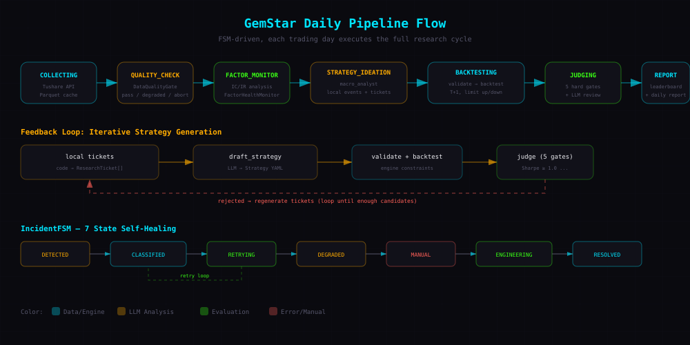
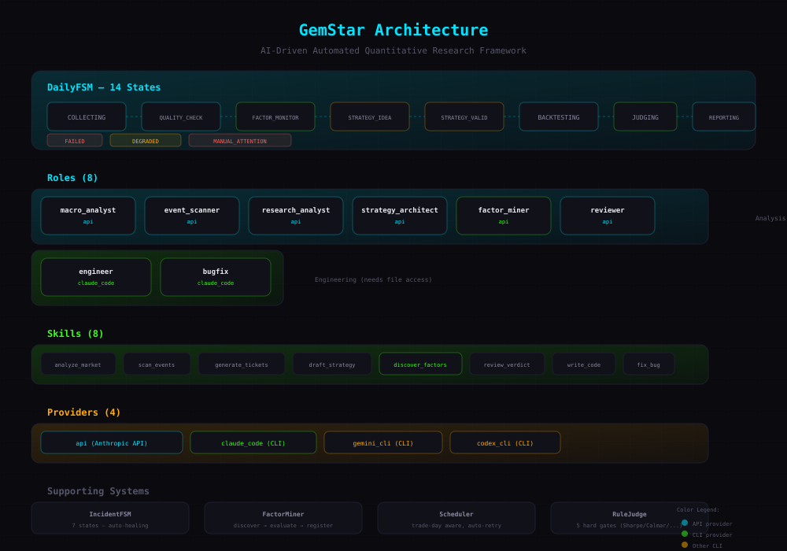
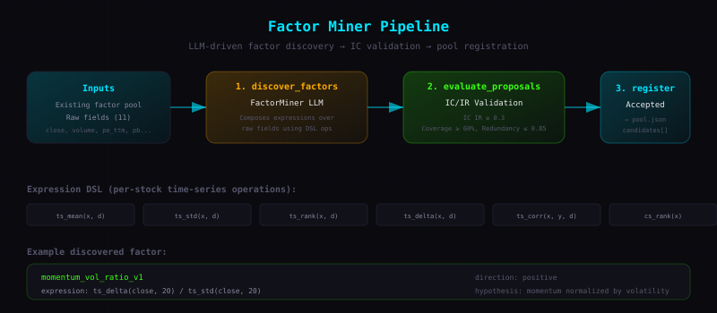

# GemStar

<p align="center">
  
</p>

量化研究与交易雷达框架。GemStar 现在按两条线组织：生产链路保持确定性、稳定、低成本；研究链路用于探索新因子和新策略，LLM 只在手动开启时参与。持仓感知，跨日跟踪。

<p align="center">
  
</p>

---

## Pipeline

`gemstar trade` 是生产链路：默认只运行 `strategies/registry.yaml` 中 `scope: production` 的正式策略，并强制关闭 LLM 策略生成。它会复用当天已完成 production run，或触发一次确定性的生产回测，然后生成交易目标、状态快照和飞书中文提醒。持仓通过 paper trading ledger 跨日跟踪。

研究探索与生产交易分开治理：

- `production`：正式策略，允许进入 `gemstar trade` 和 live targets。
- `research`：LLM draft、全 A 实验、历史想法，只用于观察和离线研究。
- `draft → candidate → paper → active → retired/rejected`：策略生命周期写在 `strategies/registry.yaml`。

重训练成本较高的策略先留在 research 侧。例如 `chinext_lstm_mf8` 是历史 LSTM 基准，当前标记为 `research/paper`；等 timer 训练缓存或更快实现稳定后，再重新晋升生产链路。

14 状态有限状态机驱动每日 pipeline。下方展示正常主路径；完整状态还包括 initialized、failed、degraded、manual_attention 等分支/终态：

```
COLLECTING → QUALITY_CHECKING → FACTOR_MONITORING → STRATEGY_IDEATION →
STRATEGY_VALIDATION → BACKTESTING → JUDGING → LEADERBOARD_BUILDING →
REPORTING → COMPLETED
```

### 核心模块

| 模块 | 职责 |
|------|------|
| DataQualityGate | 数据完整性检查，输出 pass/degraded/abort |
| FactorHealthMonitor | 基于 IC/IR 的因子健康度分析 |
| FactorMiner | 本地模板生成新因子表达式，IC/方向/覆盖率验证后注册入池 |
| MacroAnalyst | LLM 评估市场宏观状态（手动启用研究时使用） |
| EventScanner | 本地规则扫描财报、成交量、动量等事件信号 |
| ResearchAnalyst | 本地规则生成研究 ticket（假设 + 因子关联） |
| StrategyArchitect | LLM 从 ticket 草拟策略 YAML（研究链路，不自动进入生产） |
| RuleJudge | 规则引擎评估回测结果（gate 通过/拒绝） |
| Reviewer | LLM 生成评审意见（手动启用研究时使用） |
| IncidentFSM | 7 状态故障分类与自愈流程 |
| LiveRadar | 交易雷达监控，信号识别，T+1/涨跌停约束 |
| PaperLedger | 追加式 JSONL 账本，跨日持仓跟踪 |

### 本地研究核心 + LLM Role 架构

```
local deterministic modules        roles/*.yaml + role_skills/*/   src/llm/providers/
├── scanner/event_scanner.py       ├── analyze_market              ├── base.py
├── research/analyst.py            ├── draft_strategy              └── claude_code_provider.py
└── factors/miner.py               ├── review_verdict
                                   ├── write_code
                                   └── fix_bug
```

- **Local deterministic modules** — 事件、研究工单、因子 proposal 由代码生成结构化对象，不依赖模型 JSON 输出
- **Role** — YAML 配置，定义仍由 LLM 执行的 provider、skill、超时时间
- **Role Skill** — 可复用的 SOP 单元（prompt + 流程文档 + 输出 schema），用于仍由 LLM 执行的角色
- **Integration Skill** — 面向第三方兼容 `SKILL.md` 协议生态的对外查询入口，位于 `integrations/`
- **Provider** — 统一的 agent 执行接口；当前实现为 `claude_code`

<p align="center">
  
</p>

用户可通过 `gemstar.yaml` 的 `llm.provider` / `roles:` 覆盖仍由 LLM 执行的角色；当前有效取值为 `claude_code`。

`engineer` / `bugfix` 属于 engineering scope，不属于默认日线 LLM 阶段。它们同样通过 `claude_code` 执行，并受 `engineering` 路径策略约束：回测引擎、指标和评估规则默认冻结，Agent 只能修改配置允许的扩展点。

#### 角色配置

| 角色 | Provider | Skills | Timeout |
|------|----------|--------|---------|
| macro_analyst | claude_code | analyze_market | 300s |
| strategy_architect | claude_code | draft_strategy | 300s |
| reviewer | claude_code | review_verdict | 300s |
| engineer | claude_code | write_code, fix_bug | 300s |
| bugfix | claude_code | fix_bug | 300s |

以下原 LLM role 已本地化，不再存在于 `roles/*.yaml`：`event_scanner`、`research_analyst`、`factor_miner`。

#### Role Skill 目录

每个 role skill 目录位于 `role_skills/`，包含三个文件：

| 文件 | 用途 |
|------|------|
| `prompt.txt` | LLM 系统提示词 |
| `sop.md` | 标准操作流程文档（供人阅读） |
| `schema.json` | 输出 JSON schema（用于校验 LLM 输出） |

| Role Skill | 用途 |
|-------|------|
| analyze_market | 评估市场宏观状态（regime + style bias） |
| draft_strategy | 从 research ticket 草拟策略 YAML |
| review_verdict | 生成回测评审意见（解释 + 风险 + 置信度） |
| write_code | 代码编写（engineer 角色使用） |
| fix_bug | Bug 修复（engineer/bugfix 角色使用） |

#### Provider 实现

| Provider | 后端 | 说明 |
|----------|------|------|
| claude_code | Claude Code CLI | 子进程调用 Claude Code，支持分析、生成策略和工程任务 |

### 事件流

所有 Role 执行通过 `RoleEvent` 产生可观测事件（started/completed/failed），支持执行监控和调试。

---

## 项目结构

```
GemStar/
├── .env.example                # 环境变量模板
├── pyproject.toml              # 项目配置 + 依赖管理 (uv)
├── gemstar.yaml                # 项目配置（gemstar init 生成）
├── tools/                      # 附属工具
│   ├── backtest.py             # 独立回测 CLI（数据→训练→回测→报告）
│   └── tracking/               # SwanLab 实验追踪
├── roles/                      # Role YAML 配置（仍由 LLM 执行的角色）
├── role_skills/                # 内部 Role Skill（prompt.txt + sop.md + schema.json）
├── integrations/               # 对外集成 Skill（兼容 SKILL.md 协议）
├── strategies/                 # 策略 YAML 配置
├── factors/                    # 因子池 (pool.json)
├── src/
│   ├── cli/                    # CLI 入口
│   │   ├── app.py              # typer app + 全局 --output 选项
│   │   ├── config.py           # GemStarConfig + YAML loader
│   │   ├── output.py           # table / json 统一输出
│   │   └── commands/           # 子命令（run/trade/fetch/live/alerts/scheduler 等）
│   ├── data/                   # Tushare 数据拉取 + 清洗
│   ├── timer/                  # 受控择时模板 / LSTM 基线（特征 / 模型 / 信号）
│   ├── ranker/                 # 多因子选股（因子 / 标准化 / 打分）
│   ├── portfolio/              # 交易成本 + 仓位分配
│   ├── engine/                 # 回测引擎 + 绩效指标
│   ├── live/                   # 交易雷达、paper ledger、目标/快照/决策
│   ├── notify/                 # 本地 JSONL + 飞书通知 sink
│   ├── llm/                    # LLM 抽象层
│   │   ├── adapter.py          # RoleRegistry → LLMGenerate 桥接
│   │   └── providers/          # AgentProvider + Claude Code provider
│   ├── roles/                  # Role 配置加载 + 注册 + 事件流
│   ├── orchestrator/           # DailyFSM + IncidentFSM + pipeline + scheduler
│   ├── strategies/             # 策略验证 + YAML 运行器
│   ├── engineering/            # 工程自愈：task 定义 + 路径策略 + 执行器
│   ├── judge/                  # 规则引擎
│   ├── reviewer/               # LLM 评审
│   ├── research/               # 本地研究 ticket 生成
│   ├── scanner/                # 宏观分析 + 本地事件扫描
│   ├── reporter/               # 报告生成
│   ├── data_quality/           # 数据质量门
│   ├── factors/                # 因子池 + 健康监控
│   ├── ops/                    # 故障分类 + 自愈
│   └── schemas/                # Pydantic 数据模型
├── tests/                      # 单元测试
├── alerts/                     # live 通知 JSONL + paper ledger
├── artifacts/                  # pipeline 产物 + current/trade_status.md/json
├── data/                       # Tushare 原始数据缓存 (Parquet)
├── outputs/                    # 报告、演示或导出产物
└── docs/
    ├── feishu-integration.md   # 飞书自定义机器人接入指南
    ├── skill-integration.md    # 第三方 SKILL.md 协议集成指南
    └── images/                 # README 图示
```

---

## 快速开始

### 环境要求

- Python >= 3.13
- [uv](https://docs.astral.sh/uv/) 包管理器
- [Tushare Pro](https://tushare.pro/) Token
- LLM Provider（按需，见下方配置）

### 安装

```bash
git clone https://github.com/JustHappyLab/GemStar.git
cd GemStar
uv sync
```

### 配置

```bash
cp .env.example .env
# 编辑 .env，填入必要 token

# 初始化项目（生成 gemstar.yaml + state.db）
uv run gemstar init
```

#### 环境变量

| 变量 | 必需 | 说明 |
|------|------|------|
| `TUSHARE_TOKEN` | 是 | Tushare Pro API token，用于拉取 A 股数据 |
| `FEISHU_WEBHOOK_URL` | 否 | 飞书自定义机器人 Webhook，用于接收实时告警通知 |
| `FEISHU_WEBHOOK_SECRET` | 否 | 飞书自定义机器人签名密钥，开启签名校验时填写 |
| `SWANLAB_API_KEY` | 否 | SwanLab 实验追踪，仅 `tools/tracking/swanlab_run.py` 需要 |

#### 飞书通知配置

GemStar 支持通过飞书自定义机器人推送交易提醒和每日 leaderboard 观察摘要。完整步骤见 [docs/feishu-integration.md](docs/feishu-integration.md)。

如果你还没有飞书机器人 token，先看 [飞书接入指南](docs/feishu-integration.md)：里面写了如何在飞书群添加自定义机器人、复制 Webhook URL、区分 token 和签名密钥。

快速配置：

```bash
FEISHU_WEBHOOK_URL="https://open.feishu.cn/open-apis/bot/v2/hook/你的token"
# 如果飞书机器人开启了签名校验，再配置：
FEISHU_WEBHOOK_SECRET="你的签名密钥"
```

未配置飞书时，GemStar 仍会写入本地 `alerts/live.jsonl` 和 `artifacts/current/trade_status.md/json`。
每日 leaderboard 摘要默认在 `08:30` 推送，它是研究观察信息，不是下单建议；摘要会展示 LLM 草稿数、通过数和主要拒绝原因，但只读取已有 artifacts，不额外调用模型。买卖/加减仓提醒仍必须通过策略状态、行情日期、交易金额和择时门禁。

#### 交易状态文件

`gemstar trade` 每次运行都会写出当前事实底稿：

```text
artifacts/current/trade_status.md
artifacts/current/trade_status.json
alerts/live.jsonl
alerts/ledger.jsonl
```

`trade_status.md/json` 包含当前持仓、目标持仓、调仓差额、浮盈亏、风险标记和本轮策略。飞书只负责主动提醒；完整状态以这些本地文件为准，也方便第三方 skill、脚本或 dashboard 读取。

其中 `alerts/ledger.jsonl` 是 paper trading 持仓的 source of truth；`trade_status.md/json` 是当前快照，可由下一次 `gemstar trade --once` 重新生成。运行记录存放在 `state.db` 和 `artifacts/<run_id>/`，行情缓存存放在 `data/raw/`。完整约定见 [docs/state-storage.md](docs/state-storage.md)。

当前 `trade` 的交易雷达默认读取本地行情缓存/快照生成建议，不会连接券商或自动实盘下单。

#### 内置榜单策略

主分支内置了当前用于冲击 leaderboard 的策略：

```text
strategies/leaderboard_quality_lowvol_v1/config.yaml
```

该策略使用 `chinext_core` universe，组合 `roe`、`revenue_yoy`、`netprofit_yoy` 和 `low_volatility_20d_v1` 四个因子，`top_n: 26`、日频调仓、满仓择时。它的目标是在保留创业板盈利质量暴露的同时，用低波动约束降低不稳定回撤段。

可用 registry 控制它是否进入生产或研究流水线；日常命令不再直接暴露单策略运行参数：

```bash
gemstar strategies
gemstar leaderboard --scope production
```

#### 第三方 Skill 集成

GemStar 内置 `integrations/gemstar-skill`，可接入 QClaw、Codex 或其他兼容 `SKILL.md` 协议的生态，用自然语言查询当前持仓、目标持仓、调仓差额、最新提醒、leaderboard 和内置策略状态。安装步骤见 [docs/skill-integration.md](docs/skill-integration.md)。

常用查询：

```text
GemStar 当前持仓是什么？
GemStar 今天建议买卖什么？
GemStar 目标仓位和当前仓位差多少？
GemStar 最近 5 条提醒是什么？
GemStar 当前内置榜单策略是什么？
GemStar 最新 leaderboard 是什么？
```

#### LLM Provider 配置

当前仍由 LLM 执行的角色统一使用 Claude Code CLI：

| Provider | 后端 | 安装方式 | 认证 | 文件系统 |
|----------|------|----------|------|----------|
| `claude_code` | Claude Code CLI | `npm i -g @anthropic-ai/claude-code` | `claude` 登录后自动认证 | 是 |

默认角色配置（`roles/*.yaml`）：

| 角色 | 默认 Provider | 说明 |
|------|--------------|------|
| macro_analyst | `claude_code` | 市场宏观分析（返回 JSON） |
| strategy_architect | `claude_code` | 策略草稿（返回 YAML） |
| reviewer | `claude_code` | 回测评审（返回 JSON） |
| engineer | `claude_code` | 代码编写（需写文件） |
| bugfix | `claude_code` | Bug 修复（需写文件） |

事件扫描、研究工单和因子 proposal 现在由本地确定性代码生成，不再需要配置 LLM role，也不会解析模型返回的业务 JSON。

**Provider 约束**：当前配置 schema 只接受 `claude_code`。`roles.*.provider` 和 `engineering.provider` 保留为扩展点，但配置旧 provider 名称会在加载时失败。

在 `gemstar.yaml` 中覆盖角色 provider：

```yaml
llm:
  enabled: false              # 保留字段；是否启用探索由 gemstar research 决定
  provider: claude_code       # LLM 角色的默认 provider

engineering:
  enabled: false              # 工程自愈默认关闭
  provider: claude_code       # engineer / bugfix 默认 provider
  auto_execute: true          # enabled 后 pipeline 自动执行 engineering task
  auto_apply: false           # 只产出 patch/task，需人工批准合入
  forbidden_paths:
    - src/engine/**
    - src/judge/**
    - src/portfolio/cost.py
    - src/schemas/metrics.py
    - src/schemas/verdict.py

roles:
  engineer:
    provider: claude_code
    model: opus               # 可按角色覆盖 Claude Code model
  reviewer:
    provider: claude_code
    model: sonnet
```

`llm.enabled` 保留为配置字段，但日常生产链路不会读取它来开启模型；是否启用宏观分析、策略草稿、评审等 LLM 阶段由入口决定：`gemstar run` / `gemstar trade` 始终关闭，`gemstar research` 显式开启。具体后端由 `llm.provider` / `roles.*.provider` 决定，目前只支持 `claude_code`。

`engineering.provider` 是 `engineer` / `bugfix` 的默认 provider，目前只接受 `claude_code`。`roles.engineer.model` 或 `roles.bugfix.model` 可以单独覆盖模型。

Engineering 路径策略由代码硬校验，`forbidden_paths` 优先于各角色 `allowed_paths`。如果一次修复需要修改 frozen core（例如 `src/engine/**` 或 `src/judge/**`），应转为人工处理，而不是自动自愈。

启用 `engineering.enabled` 后，策略级失败会被转成 `engineering_task_*.json` artifact：

- validation 发现缺失因子或不支持的新策略模板 → `engineer`
- strategy input / backtest 的局部代码异常 → `bugfix`
- 普通坏策略（如空 factors）不会创建工程任务

默认情况下，`engineering.enabled: true` 后 pipeline 会自动执行这些 task，并在执行后用路径策略校验 diff，禁止触碰 frozen core。工程调试命令仍保留为内部入口，但不作为日常 CLI 使用方式。

只跑生产 pipeline（`gemstar run` / `gemstar trade`）只需 Tushare token；手动探索（`gemstar research`）会启用宏观分析、策略生成和评审，需要安装并登录 Claude Code CLI。

### CLI 命令

```bash
# 生产交易雷达：正式策略 → 回测/榜单 → 交易目标 → 飞书通知
gemstar trade

# 指定本金（默认 10 万）
gemstar trade --capital 500000

# 只跑一轮看效果
gemstar trade --once

# 当天已有 completed run 时会直接复用；如需强制刷新生产 run
gemstar trade --refresh

# 状态快照会自动写入 artifacts/current/trade_status.md/json

# 跟踪 leaderboard 前 5 个策略
gemstar trade --top 5

# ─── 研究与观察 ──────────────────────────────

# 启动当日生产/回测 pipeline；默认使用 production 策略，不启用 LLM
gemstar run

# 手动探索时才开启 LLM 策略生成/评审
gemstar research

# 对指定日期运行生产 registry 策略，不触发 LLM 生成/评审
gemstar run --date 20260503

# 当前手动策略先固定在 chinext_core 验证，避免全 A 财务数据补齐过慢；
# 只有在 pass/candidate 稳定后，再考虑扩展到 a_share_core。

# 查看可用角色 / 策略 / 因子
gemstar roles
gemstar strategies
gemstar factors

# 查看策略排行榜
gemstar leaderboard                # 最新一次 production 排行榜
gemstar leaderboard --run 20260503-001
gemstar leaderboard --scope production
gemstar leaderboard --scope research

# 将一次研究 run 里的 draft 晋升为正式 production 策略
gemstar promote-strategy --run 20260604-45918447 --strategy earnings_quality_neutral

# ─── 维护 ──────────────────────────────

# 拉取数据 / 查看状态 / 历史运行
gemstar fetch --start 20240101 --end 20260503
gemstar status
gemstar history

# 自动调度属于内部维护入口；日常使用优先 gemstar trade

# 环境检查（Python / uv / .env / gemstar.yaml / LLM 认证）
gemstar doctor

# 清理失败或过期的运行记录
gemstar cleanup                    # 清理 failed + manual_attention
gemstar cleanup --stale            # 额外清理超过 2 小时的 running 记录
```

所有命令支持 `--output json`（或 `-o json`）输出 JSON 格式，用于自动化集成。

首次运行 `gemstar run` 会通过 Tushare API 拉取数据并缓存到 `data/raw/`（Parquet 格式），后续运行直接读取缓存。

### 择时治理

GemStar 将“选股”和“择时”分开治理：

- AI StrategyArchitect 默认只生成选股 sleeve，策略草稿固定 `timer.mode: full`。
- AI 不自由生成 LSTM/GRU 参数、窗口、阈值或再训练计划。
- 择时通过受控模板进入比较，例如 `full`、`ma20_guard`、`ma60_guard`、`drawdown_guard`、`lstm_baseline`。
- 非 `full` timer 必须先实现、回测、评审，再允许影响 live 目标持仓。
- 详细规则见 `docs/timing-policy.md`。

### Universe 预设

普通用户无需手动选择股票池。策略 YAML 可以省略 `universe`，或使用默认：

```yaml
universe: auto
```

GemStar 会根据策略名称、假设、研究票据和因子上下文自动解析为具体股票池，并在报告的 `Universe` 段披露使用的股票池、选择原因和过滤条件。高级用户可以显式指定：

| preset | 用途 |
|--------|------|
| `a_share_core` | 默认全 A 核心可交易池，排除 ST、退市/未上市、上市不足 120 天标的 |
| `a_share_liquid` | 全 A 高流动性研究池，额外排除当日成交额最低 20% |
| `chinext_core` | 创业板核心池 |
| `star_core` | 科创板核心池 |
| `main_board_core` | 沪深主板核心池 |
| `all` | 兼容旧配置，等价于 `a_share` |

`gemstar.yaml` 里的基准指数也可以保持默认：

```yaml
benchmark: auto
```

GemStar 会根据 resolved universe 自动选择基准指数，并在报告的 `Benchmark` 段披露。例如创业板策略使用 `399006.SZ`，全 A 研究默认使用中证全指口径。

### 自动调度

GemStar 保留自动调度能力作为内部维护入口。日常运行优先使用 `gemstar trade`；需要无人值守时可启动 scheduler，后台运行，内置交易日感知和失败重试：

```bash
# 后台启动
gemstar scheduler start

# 前台运行（调试用）
gemstar scheduler start --foreground

# 查看状态 / 停止 / 重启
gemstar scheduler status
gemstar scheduler stop
gemstar scheduler restart
```

在 `gemstar.yaml` 中配置调度时间和日志路径：

```yaml
# ─── 调度 ─────────────────────────────────────────────────
schedule: "收盘后"              # 预设：收盘后 / 盘前 / 深夜
# schedule: "16:00"            # 自定义时间
# schedule: null               # 手动模式，不自动调度
```

预设说明：

| 预设 | 数据拉取 | Pipeline | 适用场景 |
|------|---------|----------|---------|
| `收盘后` | 15:30 | 16:00 | 数据新鲜，最常用 |
| `盘前` | 06:00 | 07:00 | 用昨天数据，早上看结果 |
| `深夜` | 15:30 | 02:00 | 夜间 API 便宜 |

自动拉取数据（无需手动 `gemstar fetch`）：

```yaml
data:
  scheduler_prefetch: true     # scheduler 在 run 前额外执行 gemstar fetch
  lookback_years: 2            # 训练数据回溯年数
```

Daemon 内置行为：
- 自动跳过非交易日（周末/节假日）
- 已完成的日期不重复执行
- 失败自动重试，最多 3 次
- 日志输出到 `logs/gemstar.log`（路径可在 `gemstar.yaml` 的 `log_path` 配置）
- `SIGINT` / `SIGTERM` 优雅退出

### Python API

也可以直接调用 pipeline：

```python
from src.orchestrator.pipeline import run_daily_pipeline

result = run_daily_pipeline(
    run_id="20260503-001",
    data=data_dict,           # Tushare DataFrame 映射
    strategies=[Path("...")], # 策略 YAML 路径
    pool_path=Path("factors/pool.json"),
    reference_date="20260503",
    benchmark_nav=benchmark_series,
    llm_available=True,       # 启用 LLM 策略生成
)
```

### 运行测试

```bash
uv run python -m pytest tests/ -v
```

---

## 回测引擎

内部组件，用于策略历史表现验证。模拟真实 A 股交易约束：

- **T+1**：当日买入不可当日卖出
- **涨跌停**：创业板 20% 涨跌停限制，涨停不追买，跌停不卖出
- **最小交易单位**：100 股（一手）
- **交易成本**：佣金万 2.5（最低 5 元）+ 印花税千 0.5（2023-08-28 后减半）+ 滑点万 5

### 绩效指标

| 指标 | 说明 |
|------|------|
| CAGR | 复合年化收益率 |
| Sharpe | 夏普比率（无风险利率 2.5%） |
| Max Drawdown | 最大回撤 |
| Calmar | 卡玛比率 (CAGR / MaxDD) |
| Win Rate | 胜率 |
| Profit Factor | 盈亏比 |
| Annual Turnover | 年化换手率 |
| Alpha | 相对配置基准指数的超额收益 |

### 引擎验证

**内部自洽性检验** — 6 个手算可验证的 sanity check 场景：

| 场景 | 验证内容 |
|------|----------|
| 买入持有 | NAV 跟踪收盘价方向 |
| 零仓位 | NAV 恒等于初始资金 |
| 单次 round-trip | NAV 精确到小数点后 6 位 |
| 涨停不买 | 开盘涨停 20% 时拒绝买入 |
| 跌停不卖 | 开盘跌停 20% 时拒绝卖出 |
| 同价买卖 | 必亏（成本拖累） |

**跨平台验证（vs 聚宽 JoinQuant）** — 484 个交易日，NAV 差异 0.0000%（最大偏差 1.7e-14%，浮点精度误差）。

**数据完整性** — 无未来信息泄露（财务因子用 ann_date + merge_asof；市场因子 shift(1)）、无幸存者偏差（含已退市股票）、adj_factor 后复权、T+1 交割正确。

### Factor Miner

本地模板驱动的自动因子发现管线，从原始字段组合出新 alpha 因子并验证入池：

<p align="center">
  
</p>

```
template proposals → evaluate_proposals (IC/方向/覆盖率验证) → register_accepted (入池)
```

- **输入**：现有因子池 + 原始字段（close/open/high/low/volume/amount/turnover_rate/pe_ttm/pb/total_mv/circ_mv）
- **DSL**：支持时序操作（ts_mean/ts_std/ts_rank/ts_delta/ts_corr 等）和截面操作（cs_rank/cs_zscore）
- **验收门**：方向一致的 IC IR、覆盖率 ≥ 60%、与现有因子相关性 ≤ 0.85

```bash
# 在 pipeline 中自动执行；不再调用 factor_miner LLM role
gemstar run

# 或通过 Python API 调用
from src.factors.miner import FactorMiner
```

### Leaderboard

每次 pipeline 运行后自动生成策略排行榜，包含排名、Sharpe、CAGR、最大回撤、Alpha 和排名变化。排行榜可以按策略治理范围查看：

- `production`：正式策略，允许进入 `gemstar trade`。
- `research`：实验策略和 LLM draft，仅用于观察。
- `status`：来自规则评审，常见值为 `candidate` / `rejected`。

LLM 生成的 draft 会参与当次 research leaderboard，但不会自动进入生产。确认值得跟踪后，用 `gemstar promote-strategy` 复制到 `strategies/<name>/config.yaml` 并写入 `strategies/registry.yaml`。

```bash
gemstar leaderboard                # 最新一次 production 排行榜
gemstar leaderboard --run 20260503-001
gemstar leaderboard --scope production
gemstar leaderboard --scope research
gemstar promote-strategy --run 20260604-45918447 --strategy earnings_quality_neutral
gemstar -o json leaderboard        # JSON 输出
```

---

## 技术栈

| 依赖 | 用途 |
|------|------|
| Python 3.13 | 运行时 |
| PyTorch | LSTM 模型训练与推理 |
| pandas / numpy | 数据处理与数值计算 |
| tushare | A 股数据源 |
| scikit-learn | 数据预处理 |
| Pydantic v2 | Schema 校验 |
| Claude Code CLI | LLM provider 执行 |
| typer / rich | CLI 框架 + 终端美化 |
| pyyaml | YAML 配置解析 |
| pyarrow | Parquet 数据读写 |
| matplotlib | 回测图表生成 |
| swanlab | 实验追踪（独立回测工具） |

---

## License

Private repository. All rights reserved.
