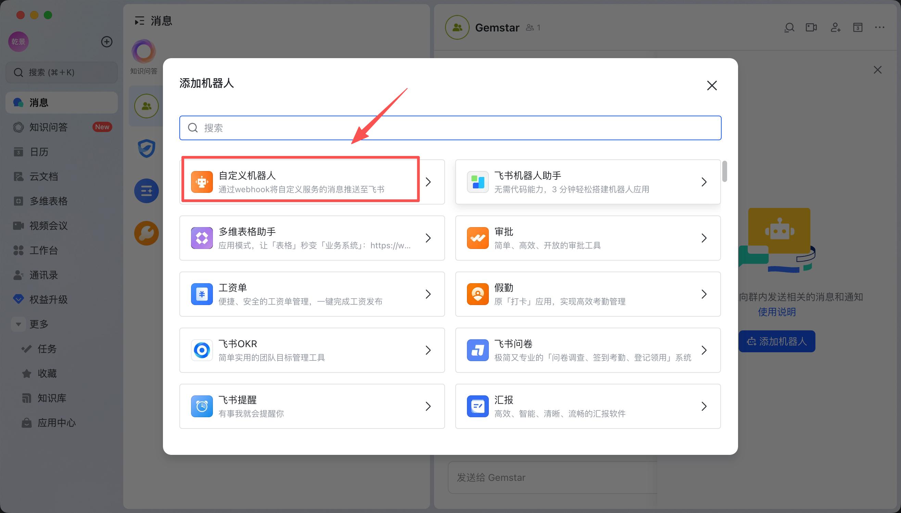
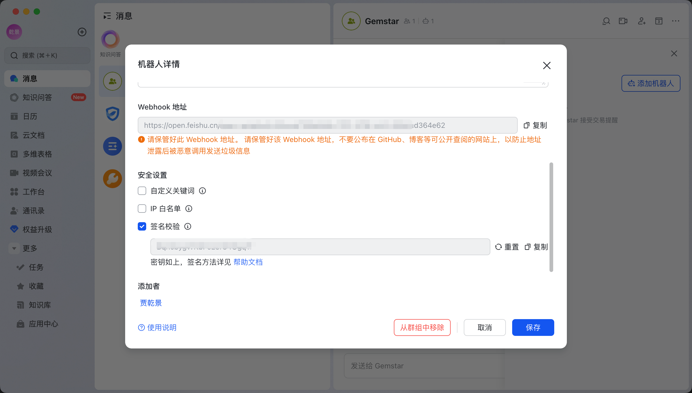

# GemStar 飞书接入指南

GemStar 使用飞书自定义机器人 Webhook 发送交易提醒。这个接入方式适合个人或小团队：配置简单，不需要完整的企业自建应用，也不影响本地 `alerts/live.jsonl` 和 `artifacts/current/trade_status.md/json` 状态记录。

官方参考：[飞书开放平台：自定义机器人使用指南](https://open.feishu.cn/document/client-docs/bot-v3/add-custom-bot)

## 1. 获取飞书 Webhook Token

GemStar 使用的是“飞书群自定义机器人”。你需要从机器人配置页拿到 Webhook 地址，地址最后一段就是 token。

操作步骤：

1. 打开飞书客户端，进入你想接收 GemStar 提醒的群。
2. 在群组右上角点击“更多”按钮，然后点击“设置”。
3. 在右侧设置界面点击“群机器人”。
4. 在“群机器人”界面点击“添加机器人”。
5. 在“添加机器人”对话框里找到并点击“自定义机器人”。
6. 设置机器人的头像、名称和描述，例如名称填 `GemStar`，然后点击“添加”。
7. 添加成功后，飞书会显示 Webhook 地址。复制完整地址，并点击“完成”。



Webhook 地址格式类似：

```text
https://open.feishu.cn/open-apis/bot/v2/hook/xxxxxxxx-xxxx-xxxx-xxxx-xxxxxxxxxxxx
```

这里的：

```text
xxxxxxxx-xxxx-xxxx-xxxx-xxxxxxxxxxxx
```

就是飞书机器人的 token。GemStar 不需要你单独拆出 token，直接把完整 Webhook 地址填到 `FEISHU_WEBHOOK_URL`。

例如：

```bash
FEISHU_WEBHOOK_URL="https://open.feishu.cn/open-apis/bot/v2/hook/xxxxxxxx-xxxx-xxxx-xxxx-xxxxxxxxxxxx"
```

## 2. 获取签名密钥 Secret

飞书自定义机器人可以配置安全策略。建议开启“签名校验”，这样别人即使拿到群信息，也不能随便向你的群推消息。

添加机器人后，后续可以从群聊里重新进入机器人详情页：

1. 在群组名称右侧点击机器人图标，打开机器人列表。
2. 找到刚才创建的自定义机器人，点击进入配置页面。
3. 也可以从群设置里打开机器人列表，再进入机器人详情页。
4. 在“安全设置”区域选择“签名校验”。
5. 飞书会生成一段签名密钥，通常以 `SEC` 开头。
6. 复制这段密钥，填入 `FEISHU_WEBHOOK_SECRET`。



例如：

```bash
FEISHU_WEBHOOK_SECRET="SECxxxxxxxxxxxxxxxxxxxxxxxx"
```

如果你没有开启签名校验，可以不配置 `FEISHU_WEBHOOK_SECRET`。但生产使用建议开启。

GemStar 会自动按飞书要求生成 `timestamp` 和 `sign`，你不需要手写签名算法。

## 3. 配置环境变量

在项目根目录 `.env` 中添加：

```bash
FEISHU_WEBHOOK_URL="https://open.feishu.cn/open-apis/bot/v2/hook/xxxxxxxx-xxxx-xxxx-xxxx-xxxxxxxxxxxx"
FEISHU_WEBHOOK_SECRET="SECxxxxxxxxxxxxxxxxxxxxxxxx"
```

如果你没有开启签名校验，可以省略 `FEISHU_WEBHOOK_SECRET`。

## 4. 测试 Webhook

如果没有开启签名校验，可以用 `curl` 直接测试：

```bash
curl -X POST "${FEISHU_WEBHOOK_URL}" \
  -H "Content-Type: application/json" \
  -d '{
    "msg_type": "text",
    "content": {
      "text": "GemStar 飞书通知测试"
    }
  }'
```

如果开启了签名校验，建议直接用 GemStar 测试，因为 GemStar 会自动生成飞书要求的 `timestamp` 和 `sign`：

```bash
uv run gemstar trade --once --max-cycles 1
```

收到飞书消息后，说明 `FEISHU_WEBHOOK_URL` 和 `FEISHU_WEBHOOK_SECRET` 配置正确。

## 5. 运行 GemStar

```bash
uv run gemstar trade --once
```

或长期运行：

```bash
uv run gemstar trade
```

长期运行时，`gemstar trade` 默认会在每天 `08:30` 推送一次最新 leaderboard 摘要。这个摘要是研究观察信息，即使当天没有可交易信号也会发送；真正的买卖/加减仓提醒仍必须通过策略状态、行情日期、交易金额和择时门禁。

可以按需调整：

```bash
uv run gemstar trade --leaderboard-notify-time 08:30 --leaderboard-notify-top 10
```

如果不想发送每日 leaderboard 摘要，可以传空字符串：

```bash
uv run gemstar trade --leaderboard-notify-time ""
```

每次运行都会同时写入：

```text
alerts/live.jsonl
artifacts/current/trade_status.json
artifacts/current/trade_status.md
```

飞书只负责主动提醒；本地文件是事实底稿，适合给第三方 skill、脚本或后续 dashboard 读取。

## 6. 推送内容

飞书消息会包含：

- 告警级别
- 标题
- 生成时间
- 正文。交易提醒会包含操作、参考价、估算金额、理由和风险；leaderboard 摘要会包含 run id、状态分布和 Top 策略指标
- 标的代码和名称。leaderboard 摘要没有具体标的时会显示为空
- 决策 ID。非交易摘要没有决策 ID

如果没有配置 `FEISHU_WEBHOOK_URL`，GemStar 不会报错，只会使用本地 JSONL 和状态文件。

## 7. 当前能力边界

当前版本使用的是飞书“自定义机器人 Webhook”，只负责向所在群推送消息。

它适合：

- 推送 GemStar 交易提醒。
- 推送每日 leaderboard 观察摘要。
- 推送受限、买入、卖出、减仓、加仓等决策消息。
- 低成本接入个人或小团队群聊。
- 不需要飞书应用审核或公网回调服务。

它不支持：

- 响应用户在群里的问题。
- 点击按钮后回写成交确认。
- 获取群成员、用户信息或历史消息。
- 私聊交互。
- 跨多个群复用同一个自定义机器人。

如果你需要“刷新状态”“确认成交”“查看原因”等按钮交互，需要升级为飞书企业自建应用机器人，并接入事件订阅和卡片回调。GemStar 当前还没有实现这部分。

## 8. 常见问题

**没有收到飞书消息**

先确认 `.env` 已被加载，`FEISHU_WEBHOOK_URL` 是完整的 `https://open.feishu.cn/open-apis/bot/v2/hook/...` 地址。注意不要只填最后一段 token，要填完整 URL。开启签名校验时，`FEISHU_WEBHOOK_SECRET` 必须与飞书后台显示的密钥一致。

**token 填哪一段？**

不用单独填 token。把飞书显示的完整 Webhook 地址填到 `FEISHU_WEBHOOK_URL`。地址最后一段 `hook/` 后面的 UUID 就是 token，但 GemStar 直接使用完整 URL。

**Secret 是不是 token？**

不是。token 是 Webhook URL 的一部分；secret 是安全设置里“签名校验”生成的密钥，通常以 `SEC` 开头。

**飞书收到消息，但状态不够详细**

飞书消息是轻量提醒。完整持仓、目标持仓、差额、浮盈亏和风险标记在：

```text
artifacts/current/trade_status.md
artifacts/current/trade_status.json
```

**想做按钮确认成交**

当前版本使用自定义机器人 Webhook，只做推送。按钮、回调、确认成交需要升级为飞书企业自建应用机器人，并接入事件订阅和卡片回调。
